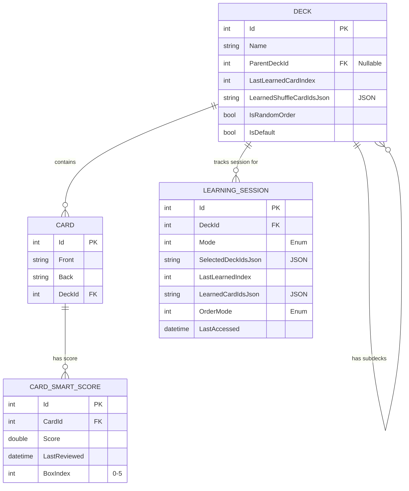

# CapyCard Datenbank-Architektur

Dieses Dokument beschreibt die Datenbankarchitektur der **CapyCard** App. Die Anwendung nutzt **SQLite** als relationale Datenbank und **Entity Framework Core (EF Core)** als Object-Relational Mapper (ORM).

Die Datenbank speichert Lernkarten, Decks (Kategorien/Stapel), Lernfortschritte und Sitzungsinformationen.

## 1. Entity-Relationship-Diagramm (ERD)

Das folgende Diagramm visualisiert die Tabellen und ihre Beziehungen zueinander.

---

## 2. Tabellen-Details

### 2.1 Tabelle: `Decks`
Repräsentiert einen Kartenstapel oder eine Kategorie. Decks können hierarchisch verschachtelt sein (Unterdecks).

| Spalte | Datentyp (C#) | Datentyp (SQLite) | Beschreibung | Constraints |
| :--- | :--- | :--- | :--- | :--- |
| **Id** | `int` | `INTEGER` | Eindeutige Identifikationsnummer des Decks. | **PK**, Auto-Increment |
| **Name** | `string` | `TEXT` | Name des Decks (z.B. "Englisch", "Kapitel 1"). | `NOT NULL`, MaxLength(100) |
| **ParentDeckId** | `int?` | `INTEGER` | Verweis auf das übergeordnete Deck. `NULL` für Hauptdecks. | **FK** (zu Decks.Id), Nullable |
| **LastLearnedCardIndex** | `int` | `INTEGER` | Speichert den Index der zuletzt gelernten Karte im sequenziellen Modus. | `NOT NULL`, Default 0 |
| **LearnedShuffleCardIdsJson** | `string` | `TEXT` | JSON-Array der IDs bereits gelernter Karten im Zufallsmodus. | `NOT NULL`, Default "[]" |
| **IsRandomOrder** | `bool` | `INTEGER` | (Legacy) Speichert, ob der letzte Modus zufällig war. | `NOT NULL` |
| **IsDefault** | `bool` | `INTEGER` | Kennzeichnet das Standard-Unterdeck ("Allgemein"). | `NOT NULL` |

### 2.2 Tabelle: `Cards`
Repräsentiert eine einzelne Lernkarte mit Vorder- und Rückseite.

| Spalte | Datentyp (C#) | Datentyp (SQLite) | Beschreibung | Constraints |
| :--- | :--- | :--- | :--- | :--- |
| **Id** | `int` | `INTEGER` | Eindeutige ID der Karte. | **PK**, Auto-Increment |
| **Front** | `string` | `TEXT` | Text/Inhalt der Vorderseite (Frage). | `NOT NULL` |
| **Back** | `string` | `TEXT` | Text/Inhalt der Rückseite (Antwort). | `NOT NULL` |
| **DeckId** | `int` | `INTEGER` | Zugehöriges Deck. | **FK** (zu Decks.Id), `NOT NULL` |

### 2.3 Tabelle: `CardSmartScores`
Speichert Metadaten für den "Smart Learning"-Modus (basierend auf Leitner-System oder ähnlichen Algorithmen).

| Spalte | Datentyp (C#) | Datentyp (SQLite) | Beschreibung | Constraints |
| :--- | :--- | :--- | :--- | :--- |
| **Id** | `int` | `INTEGER` | Eindeutige ID des Score-Eintrags. | **PK**, Auto-Increment |
| **CardId** | `int` | `INTEGER` | Verweis auf die Karte. | **FK** (zu Cards.Id), `NOT NULL` |
| **Score** | `double` | `REAL` | Prioritäts-Score. Niedriger Wert = Höhere Priorität (wird früher abgefragt). | `NOT NULL` |
| **LastReviewed** | `DateTime` | `TEXT` | Zeitstempel der letzten Abfrage. Dient als "Tie-Breaker" bei gleichem Score. | `NOT NULL` |
| **BoxIndex** | `int` | `INTEGER` | Leitner-Box (0-5). 0 = Neu/Vergessen, 5 = Gemeistert. | `NOT NULL` |

### 2.4 Tabelle: `LearningSessions`
Speichert den Zustand einer aktiven Lernsitzung, um den Fortschritt wiederherzustellen.

| Spalte | Datentyp (C#) | Datentyp (SQLite) | Beschreibung | Constraints |
| :--- | :--- | :--- | :--- | :--- |
| **Id** | `int` | `INTEGER` | Eindeutige ID der Sitzung. | **PK**, Auto-Increment |
| **DeckId** | `int` | `INTEGER` | Das Deck, für das die Sitzung gestartet wurde. | **FK** (zu Decks.Id), `NOT NULL` |
| **Mode** | `LearningMode` | `INTEGER` | Lernmodus (Enum: MainOnly=0, AllRecursive=1, CustomSelection=2). | `NOT NULL` |
| **SelectedDeckIdsJson** | `string` | `TEXT` | Bei Custom-Selection: Liste der einbezogenen Deck-IDs als JSON. | `NOT NULL` |
| **LastLearnedIndex** | `int` | `INTEGER` | Fortschritt im sequenziellen Modus. | `NOT NULL` |
| **LearnedCardIdsJson** | `string` | `TEXT` | Fortschritt im Zufallsmodus (Liste erledigter Karten-IDs). | `NOT NULL` |
| **OrderMode** | `LearningOrderMode`| `INTEGER` | Reihenfolge (Enum: Sequential=0, Random=1, Smart=2). | `NOT NULL` |
| **LastAccessed** | `DateTime` | `TEXT` | Zeitpunkt des letzten Zugriffs. | `NOT NULL` |

---

## 3. Beziehungen & Besonderheiten

### 3.1 Hierarchische Decks (Self-Referencing)
Die Tabelle `Decks` besitzt eine **Selbstreferenz**:
- Ein Deck kann ein `ParentDeck` haben.
- Ein Deck kann mehrere `SubDecks` haben.
- Dies ermöglicht eine unendlich tiefe Ordnerstruktur für Kartenstapel.
- **Lösch-Verhalten**: `OnDelete(DeleteBehavior.Cascade)` ist konfiguriert. Wenn ein übergeordnetes Deck gelöscht wird, werden alle Unterdecks automatisch mitgelöscht.

### 3.2 JSON in SQL
Einige Felder (z.B. `LearnedShuffleCardIdsJson`, `SelectedDeckIdsJson`) speichern Listen von Daten (wie z.B. `List<int>`) als serialisierten **JSON-String**. 
- **Vorteil**: Einfache Speicherung variabler Listen ohne zusätzliche Mapping-Tabellen (n:m) für temporäre Zustände.
- **Nachteil**: Nicht direkt per SQL "query-bar" (in diesem Kontext aber akzeptabel, da diese Daten nur als Block von der Applogik verarbeitet werden).

### 3.3 Enums
Die Anwendung verwendet Enums, die in der Datenbank als `INTEGER` gespeichert werden:

**LearningOrderMode:**
*   `0`: Sequential (Der Reihe nach)
*   `1`: Random (Zufällig)
*   `2`: Smart (Algorithmus-basiert)

**LearningMode:**
*   `0`: MainOnly (Nur Karten direkt im Deck)
*   `1`: AllRecursive (Karten im Deck + alle Unterdecks)
*   `2`: CustomSelection (Benutzerdefinierte Auswahl an Unterdecks)
